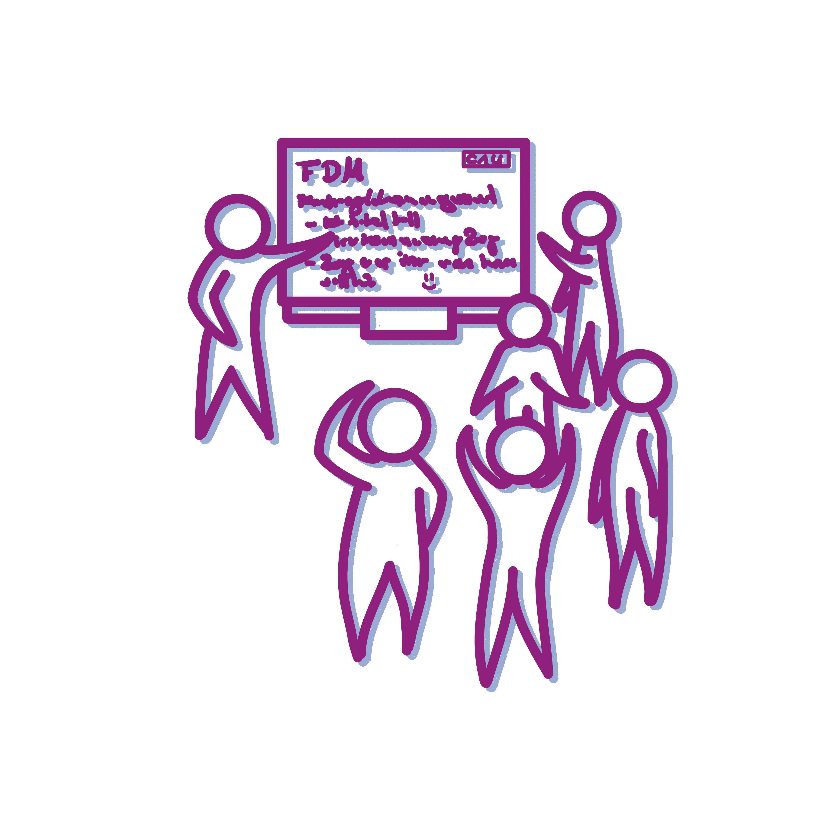

<!--

author:   Linda Zollitsch
email:    zollitsch@ub.uni-kiel.de
version:  0.1.0
language: de
narrator: UK English Female

icon:     images/Logo_cau-norm-de-lilagrey-rgb-0720_2022.png

link: https://raw.githubusercontent.com/RDM4CAU/Intro-to-RDM/refs/heads/main/cau-style.css

comment:   presentation for IRECS-meeting 2025-06-12

-->

# Welcome

<script input="button">
alert("Disclaimer: Please note that you are leaving the CAU net once you open this presentation in your browser. This presentation includes links to other third party websites and services. These sites are not under our control. RDM@CAU is not responsible for the content of linked third party websites. Please be aware that the security and privacy policies on these sites may be different than CAU policies. Please read third party privacy and security policies closely.")

"Disclaimer"
</script>

<center></center>

<div style="page-break-after: always;"></div>

> To see this document as an interactive LiaScript rendered version, click on the
> following link/badge:
>
> [](https://liascript.github.io/course/?https://raw.githubusercontent.com/LindaZollitsch/2025-06-12_IRECS/main/P2I_LZ.md#1)
>
> This work is licenced under CCBY
>  (https://creativecommons.org/licenses/by/4.0/)

<div style="page-break-after: always;"></div>

## Introduction

Linda Zollitsch

central research data management

Kiel University


## Measurements and instruments

P2I questionnaire

    Target groups:

    - secondary school students (Version S)

- undergraduates (Version S)

- graduates (Version M)

- early career researchers (Version Y)


Tool used: Limesurvey


### P2I questionnaire

{{0-1}}
********************************************************************************

P2I decided on a training with a **dialogical approach**

Therefore, the Four-Tier test also follows this idea
********************************************************************************

{{1-2}}
********************************************************************************
<!--
style="
  background-color: #fee1ff;" -->
``` ascii
           +---------+   +--------------+   +----------+
           |         |   |              |   |          |
           | Pretest +-->| Intervention +-->| Posttest |
           |         |   |              |   |          |
           +---------+   +--------------+   +----------+ 
                                |
                                V
.-------------+---------------------------------------------------------.
| Increase in the number of chosen scientifically well-founded answers  |
'-----------------------------------------------------------------------'
``` 

********************************************************************************

{{2-3}}
********************************************************************************
<!--
style="
  width: 60%;
  background-color: #fee1ff;
  stroke: #9a047f;" -->
``` ascii
           .-----------.
           | Scenario  |
           '-----------'
                 |
                 V
   o----------------------------o
   | Decision  for an action    |
   |     1 out of 4 options     |
   o----------------------------o
                 |
                 V
  +------------------------------+
  | Confidence with the decision |
  +------------------------------+
                 |
                 V
  o-------------------------------o
  | Justification for the action  |
  |        1 of 4 options         |
  o-------------------------------o
                 |
                 V
+-----------------------------------+
| Confidence with the justification |
+-----------------------------------+

``` 

********************************************************************************

{{3}}
********************************************************************************
<!--
style="
  width: 80%;
  background-color: #fee1ff;
  stroke: #9a047f;" -->
``` ascii
  o----------------------------o   +----------+
  | Decision  for an action    |-->|   WHAT   |
  |     1 out of 4 options     |   +----------+
  o----------------------------o   


 o-------------------------------o   +--------+
 | Justification for the action  |-->|   WHY  |
 |        1 of 4 options         |   +--------+
 o-------------------------------o   

``` 
********************************************************************************

## SWOT analysis

- of the P2I questionnaire

### Strengths

- collects of the content is understood

- collects if the reasoning is understood

- collects the confidence of the participants with their answer


Pre-Post design allows comparison of groups

The testdesign of multiple-choice questions allows fast / easy analysis

The four-tier testdesign allows to check the underlying concepts behind the answers due to the justifications and shows whether the choice was based on guesswork or stable beliefs


### Weaknesses

- high reading competence needed (text based questionnaire)

- long questionnaire, time consuming for participants

-----

- long, extensive development process, especially regarding the content of the scenarios as well as the distractors and the translation

- difficult to collect

- to have a complete answered item, all four tiers have to be answered to


### Opportunities

- deeper insights into reasoning which helps to design training material to overcome the non-scientific patterns

- if there is a lack of understanding in either content or reasoning, a training can foster in that direction

### Threats

- drop out rate is high 

- questionnaire will not be answered in total, too much missing answers

## Improvement?

- finding a way to shorten the items


